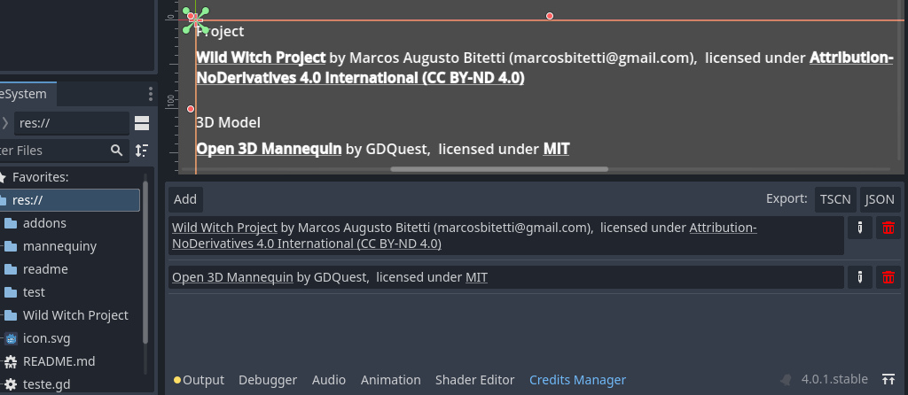

# Credits Manager

> **_NOTE:_**  This is a draft project. If the community shows interest, I'll take back the missing parts. For the moment the resources serve me.
 

Credits Manager is a tool designed to manage credits references about any project resources.

This tool enables you to easily track and acknowledge the contributions of team members, volunteers, or any external resources that have helped your project.



## Features
* Add, edit and delete credit references for your project resources
* Filter credits by resource type
* Export credits data to **JSON** formats
* Automatic create a credits-list.tscn for use in your scenes
* User-friendly interface integrated into the Godot editor

## Technologies Used
* GDScript for the front-end and back-end
* Godot API for the Godot editor integration
* Go for extend editor capatibilies

## Installation
### First, the plugin
#### From Asset Librady
* Type Credits Manager in Assets fiter
* Click to install
* Enable the plugin in your Godot project's project settings
* Go to [Next Sesion](#second-data-file)
#### From Github
* Download the latest release from the releases page
* Extract the contents of the zip file into your Godot project's addons directory
* Enable the plugin in your Godot project's project settings
* Go to [Next Sesion](#second-data-file)
### Second, data file
* Edit `source-database.json`
* Change the key `"database": "file.sqlitedb",` to point to any folder in you disk. Ex:

```
...
"database": "C:/johndoepc/projects/credis.sqlitedb",
...
```
This last step is importante, because `file.sqlitedb` can be used between projects, sharing the same data.


## Usage
* Click in Credits Manager buttom in bottom panel in the Godot editor
* Add a new credit by clicking the *"Add"* button and filling in the form
* Edit or delete a credit by selecting it from the credits list and clicking the respective button
* Export credits data by clicking the *"Export"* button and selecting the desired format
* Create a  credits scene by clicking the *"Export as **tscn**"* button and selecting the desired format

## License
This project is licensed under licence CC0 1.0 Universal. See the LICENSE file for details.
